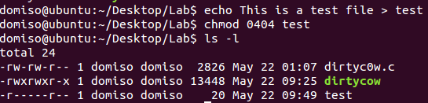
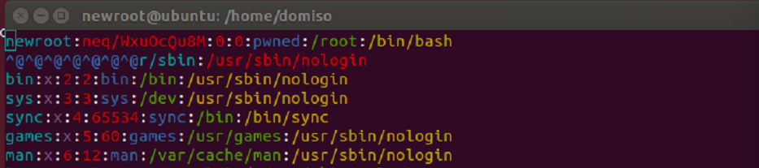

# BIT_NetworkSecurity2021Spring
北京理工大学本科网络与信息安全课程大作业
方向：漏洞攻击利用

The final work of Network Security Course

CVE-2016-5195

# Dirty COW漏洞的探讨和利用

## 1 漏洞介绍

​		2016年10月18日，黑客Phil Oester提交了隐藏长达9年之久的“脏牛”漏洞（Dirty COW）。2016年10月20日，Linux内核团队成员、Linux的创始人Linus修复了这个漏洞。该漏洞是Linux内核中get_user_page函数在处理写时复制(Copy-on-Write)过程中，可能产生条件竞争，从而造成写时复制过程被破坏，导致出现能够写数据到进程地址空间内只读内存区域的机会，即破坏私有的只读内存映射。利用该漏洞，攻击者可以对目标系统的只读文件进行恶意修改。在此基础上还可以进行进一步的改动，从而获得root权限。该漏洞的编号为CVE-2016-5195。

## 2 漏洞原理分析

​		当我们在向带有MAP_PRIVATE标记的只读文件映射区域写数据时，会产生一个映射文件的复制(COW)，对此区域的任何修改都不会写回原来的文件。而如果上述的条件竞争发生，就能成功的写回原来的文件。

### 2.1 源代码分析

​		发现者在GitHub上公开了利用该漏洞进行攻击的源程序dirtyc0w.c。大致结构如下面的伪代码所示：

```
Thread1:
	f=open("/proc/self/mem",O-RDWR)
	while(1)
		lseek(f,map,SEEK_SET)
		write(f,shellcode,strlen(shellcode))
Thread2:
	while(1)
		madvise(map,100,MADV_DONTNEED)
main:
	fd=open(filename,O-RDONLY)
	fstat(fd,&st)
	map=mmap(NULL,st.st_size,PROT_READ,MAP_PRIVATE,fd,0)
	Thread1
	Thread2
```

​		首先，打开我们想要修改的只读文件，使用参数为MAP_PRIVATE的mmap函数将该文件映射到内存区域中。然后启动两个线程。线程1向文件映射的内存区域写入数据，此时内核会调用COW过程；线程2使用带MADV_DONTNEED参数的madvise函数对主程序中的内存映射进行释放，即干扰线程1的COW过程。这两个线程之间就会产生条件竞争，在其中的某个时刻，线程1会获得该文件映射的写入权限，从而成功将数据写入本为只读属性的文件中。

​		madvise系统调用常用于用户态程序主动告知内核使用内存的方式，以优化系统性能。在本程序中，以MADV_DONTNEED为参数的作用是为了通知内核，用户态程序在后续操作中不会再使用该指定的内存区域，故该区域的映射可以释放掉（内核将该内存区域在该用户态程序的页表中对应的页表项清空）。

### 2.2 系统调用逻辑漏洞分析

​		写时复制(COW)在调用write函数时，经过一系列调用(write->mem_write->mem_rw->access_remote_vm->__access_remote_vm)，通过access_remote_vm的get_user_pages来获得页。漏洞就发生在get_user_pages中。该函数的逻辑结构如下：

```
get_user_pages
	__get_user_pages
		retry:
			follow_page_mask(...,flag,...)//通过内存地址找内存页
				follow_page_pte(...,flag,...)
					if((flags & FOLL_WRITE) && !pte_write(pte)) return NULL//如果获取页表项时要求页表项所指向的内存映射具有写权限，但是页表项所指向的内存并没有写权限。则会返回空
					return page
			if (doll_flags & FOLL_WRITE)
				fault_flags |= FAULT_FLAG_WRITE;
			if(!page)
				faultin_page():
					...
					ret = do_cow_fault()//利用COW生成页表，建立映射
				if(ret == 0)
					goto retry;
```

​		可以看出，当page为NULL且ret为0时，get_user_pages将陷入retry循环中，反复调用follow_page_mask()和faultin_page()函数，直到循环条件不满足时结束循环。其中有两个函数极为重要，follow_page_mask和faultin_page，其中follow_page_mask来找到页，faultin_page在寻页失败的时候建立映射为下次调用follow_page_mask来做准备。也就是说，follow_page_mask()函数和faultin_page()函数由于对相同的页表项pte或page结构进行处理，在程序执行中逻辑上应属于同一个原子操作中，即：

```
操作A：follow_page_mask() -> 操作B：faultin_page() -> 操作C：follow_page_mask()
```

​		但是在真实的执行逻辑中，并不存在对应的保证原子一致性的保护，该操作序列极易被打断（特别是在真实代码中，该操作序列中还存在调度逻辑）。如果存在修改同一页表项pte的其他执行流在上述操作B和操作C之间被内核调用，就可能改变操作B的执行效果，从而影响操作C及后续内核上下文的执行情况。相对应的，前面提到的madvise系统调用，就可以起到这样的作用。

​		在madvise(MADV_DONTNEED)的关键逻辑中存在对页表项pte的清零操作。当retry循环的操作B完成后（分配新的页表项pte），另一条执行流madvise(MADV_DONTNEED)被调度执行时，操作B的执行效果将被重置。此时，retry循环代表的执行流又重新获取执行资源后，操作C将返回NULL，faultin_page()函数又将重新执行。如果内核开发者未预料到该情况并且faultin_page()函数在全局资源或上下文语义上不是简单的可重入函数的话，本次条件竞争问题将会对系统产生难以预料的副作用。

​		因此，这就是该条件竞争漏洞的竞争原因。操作B和操作C之间的执行资源，就是该条件竞争漏洞的竞争点。竞争方式就是利用madvise(MADV_DONTNEED)修改faultin_page()函数分配的页表项pte。实际竞争执行流如下：

```
re-try执行流: follow_page_mask()返回NULL（readonly或NULL）
re-try执行流: faultin_page()返回0，（dirty & readonly page）
re-try执行流：follow_page_mask()返回NULL（readonly）
re-try执行流: faultin_page()返回0，（将FOLL_WRITE标记取消）
madvise执行流：zap_pte_range() (pte清零)
re-try执行流：follow_page_mask()返回NULL（pte==0）//此刻，由于失去FOLL_WRITE标志，接下来的faultin_page()函数调用会认为其在应对一个“读”情况
re-try执行流: faultin_page()返回0，（alloc page-cache page）
```

​		此时，faultin_page()会从page cache中请求分配了page（在实际的竞争过程中，该page基本都是同一个），并且page dirty标志位被标记，page内容被重新初始化对应的映射的文件中对应偏移位置开始的一页。

​		当_get_user_pages()函数完成page-cache page分配和页表项修复后，write系统调用继续运行并完成了用户的写请求，用户数据被写入目标内存，即该page-cache page。注意，由于原始normal page的pte拥有的写标志位为0，page-cache page对应的写标志位同样为0，此处是内核的写用户空间的正常功能。

​		当file mapped page-cache page的内容被修改后，内核的dirty-writeback线程将会负责将内容回写到文件中，高权限文件因而被修改。

​		以上就是该漏洞的逻辑流程，下面我们动手实现这样的修改只读文件测试，并进一步编程实现利用该漏洞获得root权限。

## 3 漏洞利用程序的实现

### 3.1 修改只读文件

本实验目标机使用的Linux系统版本为Ubuntu 14.04.5，在该环境中加载并编译漏洞利用程序，实现对只读文件的修改。实验步骤如下：

* 在实验文件夹下建立源程序文件dirtyc0w.c，并使用以下命令编译，效果如图。

  ```
  gcc -pthread dirtyc0w.c -o dirtycow
  ```

  

* 创建test文件，并将其修改为只读文件。

  

* 使用以下命令调用dirtycow程序，对test文件进行越权写入，效果如图。

  ```
  ./dirtyc0w test 0000000000000000000000
  ```

  

  可以看到，该文件已经被越权修改，该漏洞被成功利用。

### 3.2 获取root权限

​		受到该源代码的启发，本次实验尝试编写程序提取系统的root权限。

​		由dirtycow的攻击过程可以看到，当在写时复制时产生竞态状况时，该漏洞能够被利用。我们可以利用这种方式，对/etc/passwd文件进行修改。由于该文件的第一行是root用户的用户名、权限等信息。我们如果能够构造一个新的用户，将root用户的位置覆盖，同时保证信息格式和权限的正常，理论上就相当于将系统的root用户重置为了我们设定的新用户，从而获得root权限！

​		攻击程序命名为DirtyCowOfDomiso.c，程序中主要攻击过程可分为以下几部分：

* 构造格式正确的新用户newroot信息，除了用户名和密码之外，其余信息均和root用户保持一致即可。（密码要通过ceypt函数进行加密）

* 以只读形式将文件"/etc/passwd"映射到内存空间中，对其构造竞态条件，实现COW非法写入，将新用户信息写入原文件中。

  代码实现中用到了父子进程和ptrace系统调用。具体流程为：

  * 在建立文件映射之后，使用fork函数创建子进程，在子进程中创建madviseThread线程，该线程重复调用madvise函数，告知内核，该区域的映射可以释放。

  * 父进程重复调用ptrace函数，形式如下：

    ```
    for(i=0;i<10000/l;i++)//l为新用户格式化信息的字节长度
    	for(j=0;j<l;j++)
    		for(u=0;u<10000;u++)
    			c+=ptrace(PTRACE_POKETEXT,
                          pid,
                          map+j,
                          *((long*)(complete_info + j)));
    ```

    ptrace的参数为PTRACE_POKETEXT，意为不断将*(complete_info + j)的信息写入到地址(map+j)中。在这样的多重循环内，通过重复的多次调用创造竞争条件，实现字符的全部越权写入。

* 攻击结束后，在终端输入"su newroot"，随后输入密码，若成功获得root身份，表示攻击成功！

程序编写完毕后，我们在与上一次攻击相同的实验环境下进行实验，验证其有效性。

- 在实验目录下建立文件DirtyCowOfDomiso.c，并使用gcc命令对其进行编译，生成的目标文件命名为dirty。

- 编译完成后，运行dirty文件，参数为新用户newroot的密码，这里设为001228，程序开始进行攻击。如果成功，程序会输出"Done! ..."。运行结果如图所示：

  

  可以看出，程序攻击成功。下面我们进行验证。

- 在终端输入su newroot命令，输入密码001228，如图所示：

  

  可以看到，当前用户已经成功被切换为newroot，输入id查看该用户信息。再查看/etc/passwd文件，如图所示，第一行已经被修改成了newroot的信息。



## 4 总结与思考

​		本次实验，通过漏洞原理的分析，我感受到，看似安全的系统很有可能是脆弱的，容易因为某个不起眼的逻辑漏洞而意想不到地被轻易攻破。内核程序的逻辑一定要足够严谨和缜密，并且原子操作之间要尽量减少不必要的分离。

​		本次实验的漏洞攻击也是一种偏向于“暴力”的方式。起初在编写提权程序时，我没有意识到需要设置很高的循环次数，以至于攻击程序基本毫无作用。在模仿dirtyc0w程序设置循环次数之后才顺利完成了攻击。换一种方式理解，它也像是两个线程都在不停地运行各自的系统调用，希望在某个时间点能够碰撞出想要的竞态条件，达到越权写入的目的。

