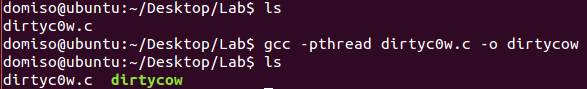
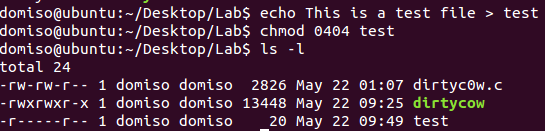
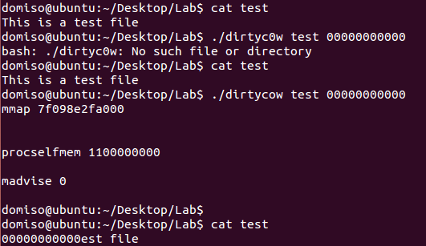
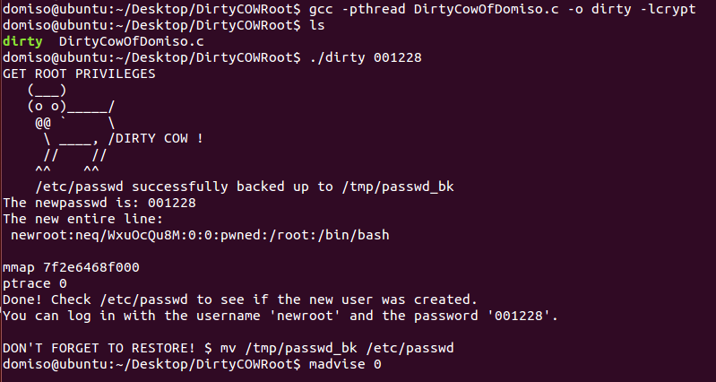
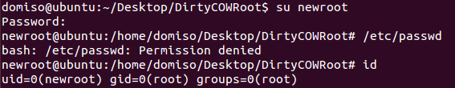

BIT undergraduate network and information security course assignment

## 3 Implementation of exploit program

### 3.1 Modify read-only files

The Linux system version used by the target machine of this experiment is Ubuntu 14.04.5. In this environment, the exploit program is loaded and compiled to modify the read-only files. The experimental steps are as follows:

* Create the source program file dirtyc0w.c under the experiment folder, and use the following command to compile, the effect is as shown in the figure.

   ```
   gcc -pthread dirtyc0w.c -o dirtycow
   ```

   

* Create a test file and modify it to read-only.

   

* Use the following command to call the dirtycow program to write the test file without authorization, as shown in the figure.

   ```
   ./dirtyc0w test 0000000000000000000000
   ```

   

   It can be seen that the file has been modified without authorization, and the vulnerability has been successfully exploited.

### 3.2 Get root permission

Inspired by the source code, this experiment attempts to write a program to extract the root privileges of the system.

As can be seen from dirtycow's attack process, this vulnerability can be exploited when a race condition occurs during copy-on-write. We can use this method to modify the /etc/passwd file. Because the first line of the file is the user name, permissions and other information of the root user. If we can construct a new user, cover the location of the root user, and at the same time ensure the normal information format and permissions, in theory, it is equivalent to resetting the root user of the system to the new user we set, so as to obtain root permissions!

​ The attack program is named DirtyCowOfDomiso.c, and the main attack process in the program can be divided into the following parts:

* Construct the new user newroot information in the correct format. Except for the user name and password, the rest of the information should be consistent with the root user. (The password should be encrypted by the ceypt function)

* Map the file "/etc/passwd" to the memory space in read-only form, construct a race condition for it, realize COW illegal writing, and write new user information into the original file.

   The parent-child process and ptrace system calls are used in the code implementation. The specific process is:

   * After the file mapping is established, use the fork function to create a child process, create a madviseThread thread in the child process, and this thread repeatedly calls the madvise function to inform the kernel that the mapping of this area can be released.

   * The parent process repeatedly calls the ptrace function in the following form:

     ```
     for(i=0;i<10000/l;i++)//l is the byte length of the information formatted by the new user
     for(j=0;j<l;j++)
     for(u=0;u<10000;u++)
     c+=ptrace(PTRACE_POKETEXT,
                           pid,
                           map+j,
                           *((long*)(complete_info + j)));
     ```

     The parameter of ptrace is PTRACE_POKETEXT, which means to continuously write the information of *(complete_info + j) to the address (map+j). In such multiple loops, a race condition is created through repeated calls to realize all unauthorized writing of characters.

* After the attack is over, enter "su newroot" in the terminal, and then enter the password. If the root identity is obtained successfully, the attack is successful!

After the program is written, we conduct experiments in the same experimental environment as the previous attack to verify its effectiveness.

- Create the file DirtyCowOfDomiso.c in the experiment directory, and use the gcc command to compile it, and the generated object file is named dirty.

- After compiling, run the dirty file. The parameter is the password of the new user newroot, which is set to 001228 here, and the program starts to attack. If successful, the program outputs "Done! ...". The running result is shown in the figure:

   

   It can be seen that the program attack is successful. Let's verify it below.

- Enter the su newroot command in the terminal and enter the password 001228, as shown in the figure:

   

   It can be seen that the current user has been successfully switched to newroot, enter the id to view the user information. Check the /etc/passwd file again, as shown in the figure, the first line has been modified to newroot information.
